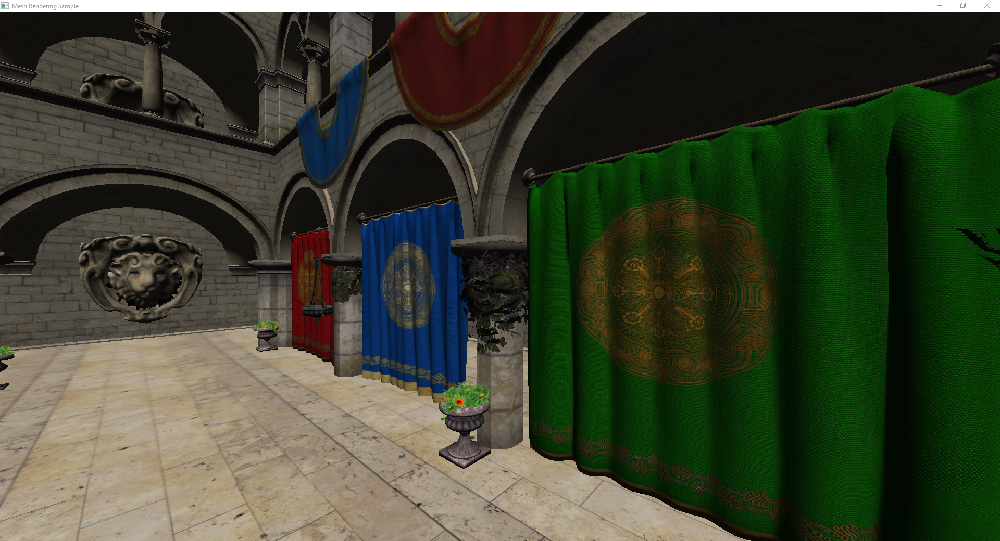

LongBow
=======

A C++17 rendering framework with pluggable graphics backends. Rendering, input
and networking are shared libraries loaded at runtime, so the engine core links
against interfaces and never against a graphics API.




Backends
--------

| Backend | Windowing | State |
|---|---|---|
| **OpenGL 4.5** | GLFW | All nine examples. Core profile, direct state access throughout, driver diagnostics routed into the log |
| **Vulkan 1.3** | GLFW | All nine examples, including hardware ray tracing |
| **DirectX 11** | Win32 | Seven of nine. No ray tracing, and input still goes through GLFW |
| **DirectX 12** | — | Not yet ported |

A build contains whichever backends the machine can produce; the rest are
skipped rather than failing the configure.

Building
--------

```bash
cmake -S . -B build
cmake --build build --config Debug
```

Requirements: CMake 3.24, a C++17 compiler, and for the optional backends a
Vulkan SDK and the Windows SDK. GLFW, GLEW and Optick are fetched at configure
time; glslang, shaderc and SPIRV-Cross come from the Vulkan SDK. Nothing is
vendored except LoadPNG.

| Option | Default |
|---|---|
| `LONGBOW_BUILD_OPENGL`, `_DIRECTX11`, `_DIRECTX12`, `_VULKAN` | auto-detected |
| `LONGBOW_BUILD_EXAMPLES` | ON |
| `LONGBOW_ENABLE_PROFILER` | OFF |

Executables and the backend plugins land in `build/bin/` together, which is
required: a plugin is opened by bare filename at runtime.

Running the examples
--------------------

Each example picks its backend at runtime:

```bash
build/bin/03_Triangle --backend opengl
```

`opengl`, `directx11`, `directx12` and `vulkan` are accepted, as is the
`LONGBOW_BACKEND` environment variable. Set `LONGBOW_NO_ERROR_DIALOG` for
unattended runs, or a fatal error opens a message box and waits.

| # | Example | Shows |
|---|---|---|
| 00 | TimerTest | High-resolution timing |
| 01 | Input | Keyboard and mouse |
| 02 | HelloWorld | Window, clear, present |
| 03 | Triangle | Vertex buffers and a shader program |
| 04 | Cube | Index buffers, depth testing |
| 05 | Textures | Textures and samplers |
| 06 | MeshRendering | Model and material loading |
| 07 | Framebuffer | Rendering to a texture |
| 08 | ComputeShader | Storage buffers and dispatch |
| 09 | PathTracing | Ray tracing (Vulkan only) |

Shaders
-------

The examples are written once, in GLSL. The Vulkan backend compiles it to
SPIR-V; the DirectX 11 backend translates it through SPIR-V to HLSL and on to
DXBC, using shaderc and SPIRV-Cross from the Vulkan SDK. Source that is already
HLSL is passed through. That is why the same example runs on every backend
without carrying a second shader set.

Architecture
------------

```
source/CoreSystems      math, logging, timing, geometry
source/Platform         file I/O
source/Resources        images, meshes, materials, point clouds
source/RenderDevice     rendering interfaces and the plugin manager
source/InputDevice      input interfaces and the plugin manager
source/RenderDeviceImplementations/<Backend>
source/InputDeviceImplementations/<Backend>
source/Examples
```

Each module keeps its public headers under `include/<Module>/`, included as
`<Module/Foo.h>`. A backend builds to a shared library exporting one
`extern "C"` factory, which the matching manager resolves after opening it by
name. The factory takes the logger by reference, because a singleton does not
cross a shared-library boundary on Windows.

The interface is being split in two: a *classic* tier for OpenGL and DirectX 11,
whose APIs are immediate and stateful, and a *thin* tier for Vulkan and
DirectX 12, which are explicit. [docs/ARCHITECTURE.md](docs/ARCHITECTURE.md)
explains why, [docs/PLAN.md](docs/PLAN.md) tracks the work, and
[docs/INVENTORY.md](docs/INVENTORY.md) records what the starting material was.

License
-------

MIT, see [LICENSE](LICENSE).
